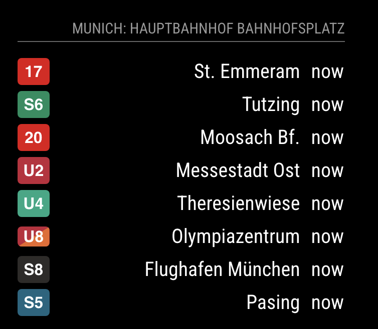
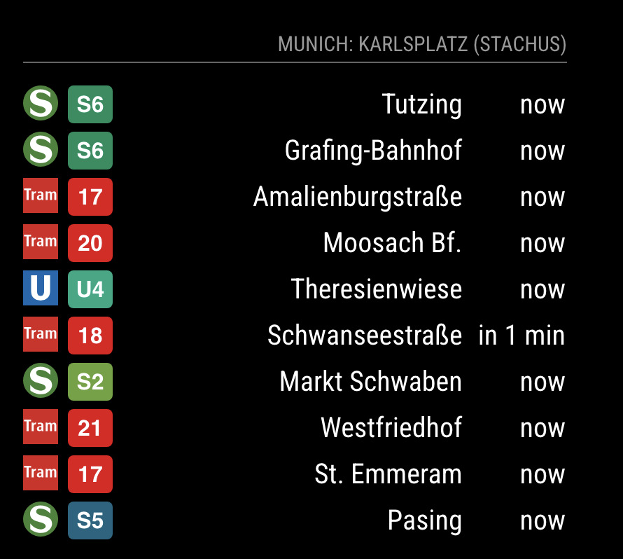
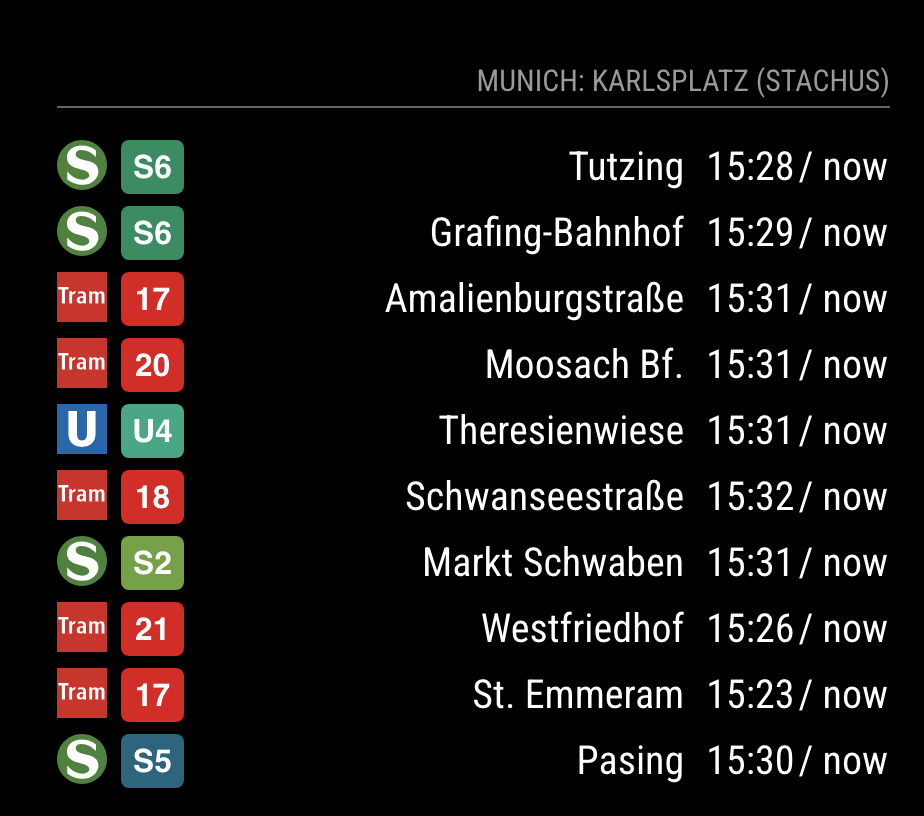
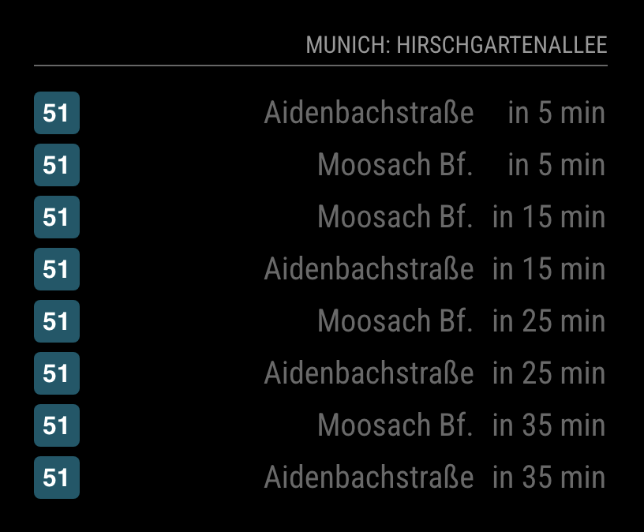
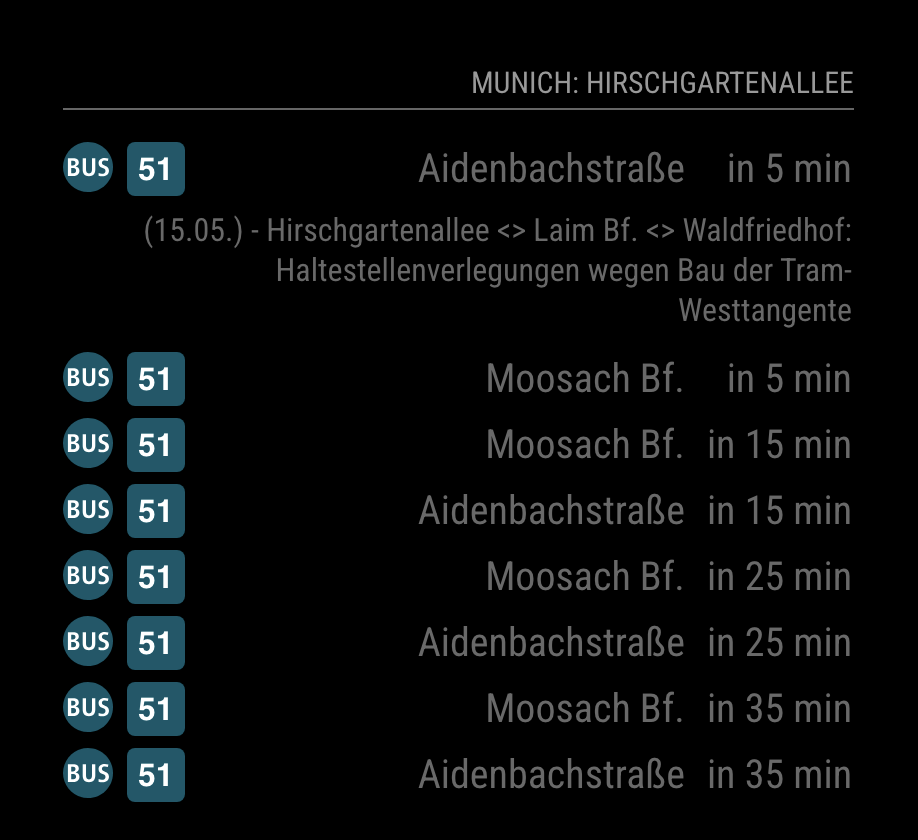
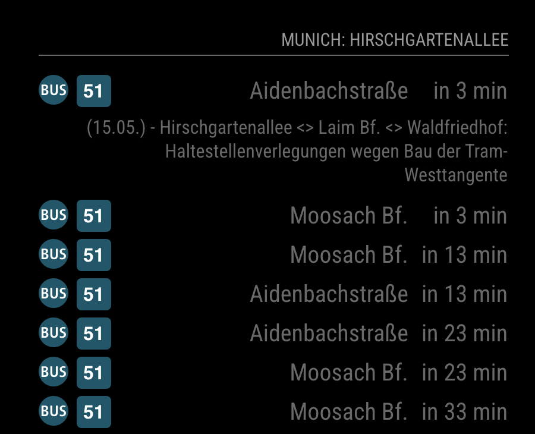

# MMM-MVG [](https://github.com/KoblerS/MMM-MVG/raw/master/LICENSE) [](https://snyk.io/test/github/KoblerS/MMM-MVG)

MagicMirror² Module to monitor public transport (U-Bahn, Tram, Bus, S-Bahn) in Munich - Germany.

> [!CAUTION]
> This magic mirror module is an independent project and is not affiliated with, endorsed by, or associated with MVG (Münchner Verkehrsgesellschaft mbH), the Munich public transportation company. Any use of data or information related to MVG services is for personal, non-commercial purposes and should comply with their terms of use.

## Installation
1. Clone the module into your MagicMirror module folder and execute `npm install` in the module's directory.
```bash
cd ~/MagicMirror/modules
git clone https://github.com/KoblerS/MMM-MVG
```

## Configuration

To display the module insert it in the config.js file.

### Simple configuration
```javascript
{
    module: "MMM-MVG",
    position: "bottom_left",
    header: "MVG",
    config: {
        station: "Hauptbahnhof",
        maxEntries: 10,             // 10 items on screen
        updateInterval: 60000,      // 60 s
        showIcons: true,            // Show transport type icon
        transportTypesToShow: {
            "ubahn": true,            // show ubahn route
            "sbahn": true,            // show sbahn route
            "bus": true,              // show bus route
            "regional_bus": true,     // show regional bus route
            "tram": true              // show tram route
        },
        ignoreStations: [],         // lines with destination to which should not be shown
        lineFiltering: {
            "active": true, 			// set this to active if filtering should be used
            "filterType": "whitelist", 	// whitelist = only specified lines will be displayed, blacklist = all lines except specified lines will be displayed
            "lineNumbers": ["U1", "U3", "X50"] // lines that should be on the white-/blacklist
        },
        timeToWalk: 10,             // 10 min walking time to station. Default is 0
        showWalkingTime: false,     // if the walking time should be included and the starting time is displayed
        showTrainDepartureTime: true,             // show tran departure time
        trainDepartureTimeFormat: "relative",     // format of the train departure time
        walkingTimeFormat: "relative",            // format of the walking time
        showInterruptions: true,				    // show interruptions as gray-out rows
        showInterruptionsDetails: false,		    // show details of interruptions in next line
        countInterruptionsAsItemShown: false,	    // count interruptions details lines as a line shown
    }
}
```

## Examples

|     |     |
| --- | --- |
|  **Stations names with arrival time**  |  | 
```javascript
config: {
    station: "Hauptbahnhof",
    maxEntries: 10,             // 10 items on screen
    updateInterval: 60000,      // 60 s
    showIcons: false,            // Show transport type icon
    transportTypesToShow: {
        "ubahn": true,            // show ubahn route
        "sbahn": false,            // show sbahn route
        "bus": false,              // show bus route
        "regional_bus": false,     // show regional bus route
        "tram": false              // show tram route
    },
    ignoreStations: [],         // destination not to be shown
    timeToWalk: 0,             // 10 min walking time to station. Default is 0
    showWalkingTime: false,     // if the walking time should be included and the starting time is displayed
    showTrainDepartureTime: true,     // show tran departure time
    trainDepartureTimeFormat: "relative",   // format of the train departure time
    walkingTimeFormat: "relative",    // format of the walking time
}
```

|     |     |
| --- | --- |
| **Stations names with icons and arrival time** |  |
```javascript
config: {
    station: "Karlsplatz",
    maxEntries: 15,             // 10 items on screen
    updateInterval: 60000,      // 60 s
    showIcons: true,            // Show transport type icon
    transportTypesToShow: {
        "ubahn": true,            // show ubahn route
        "sbahn": true,            // show sbahn route
        "bus": false,              // show bus route
        "regional_bus": false,     // show regional bus route
        "tram": true              // show tram route
    },
    ignoreStations: [],         // destination not to be shown
    timeToWalk: 0,             // 10 min walking time to station. Default is 0
    showWalkingTime: true,     // if the walking time should be included and the starting time is displayed
    showTrainDepartureTime: true,     // show tran departure time
    trainDepartureTimeFormat: "relative",   // format of the train departure time
    walkingTimeFormat: "relative"    // format of the walking time
}
```

|     |     |
| --- | --- |
|  **Stations names with icons, arrival time and walking time** |  |
```javascript
config: {
    station: "Karlsplatz",
    maxEntries: 15,             // 10 items on screen
    updateInterval: 60000,      // 60 s
    showIcons: true,            // Show transport type icon
    transportTypesToShow: {
        "ubahn": true,            // show ubahn route
        "sbahn": true,            // show sbahn route
        "bus": true,              // show bus route
        "regional_bus": false,     // show regional bus route
        "tram": true              // show tram route
    },
    ignoreStations: [],         // destination not to be shown
    timeToWalk: 0,             // 10 min walking time to station. Default is 0
    showWalkingTime: true,     // if the walking time should be included and the starting time is displayed
    showTrainDepartureTime: true,     // show tran departure time
    trainDepartureTimeFormat: "absolute",   // format of the train departure time
    walkingTimeFormat: "relative"    // format of the walking time
}
```

|     |     |
| --- | --- |
| **Stations names with icons, arrival time and disruption marking** |  |
```javascript
config: {
    station: "Harras",
    maxEntries: 10,             // 10 items on screen
    updateInterval: 60000,      // 60 s
    showIcons: true,            // Show transport type icon
    transportTypesToShow: {
        "ubahn": true,            // show ubahn route
        "sbahn": true,            // show sbahn route
        "bus": true,              // show bus route
        "regional_bus": false,     // show regional bus route
        "tram": false              // show tram route
    },
    ignoreStations: [],         // destination not to be shown
    timeToWalk: 0,             // 10 min walking time to station. Default is 0
    showWalkingTime: false,     // if the walking time should be included and the starting time is displayed
    showTrainDepartureTime: true,     // show tran departure time
    trainDepartureTimeFormat: "absolute",   // format of the train departure time
    walkingTimeFormat: "relative",    // format of the walking time
    showInterruptions: true,
    showInterruptionsDetails: false,
    countInterruptionsAsItemShown: false
}
```

|     |     |
| --- | --- |
| **Stations names with icons, arrival time, disruption marking and disruptions details** (disruption details are not counted as new lines)|  |
```javascript
config: {
    station: "Harras",
    maxEntries: 10,             // 10 items on screen
    updateInterval: 60000,      // 60 s
    showIcons: true,            // Show transport type icon
    transportTypesToShow: {
        "ubahn": true,            // show ubahn route
        "sbahn": true,            // show sbahn route
        "bus": true,              // show bus route
        "regional_bus": false,     // show regional bus route
        "tram": false              // show tram route
    },
    ignoreStations: [],         // destination not to be shown
    timeToWalk: 0,             // 10 min walking time to station. Default is 0
    showWalkingTime: false,     // if the walking time should be included and the starting time is displayed
    showTrainDepartureTime: true,     // show tran departure time
    trainDepartureTimeFormat: "absolute",   // format of the train departure time
    walkingTimeFormat: "relative",    // format of the walking time
    showInterruptions: true,
    showInterruptionsDetails: true,
    countInterruptionsAsItemShown: false
}
```

|     |     |
| --- | --- |
| **Stations names with icons, arrival time, disruption marking and disruptions details** (disruption details are counted as new lines) |  |
```javascript
config: {
    station: "Harras",
    maxEntries: 10,             // 10 items on screen
    updateInterval: 60000,      // 60 s
    showIcons: true,            // Show transport type icon
    transportTypesToShow: {
        "ubahn": true,            // show ubahn route
        "sbahn": true,            // show sbahn route
        "bus": true,              // show bus route
        "regional_bus": false,     // show regional bus route
        "tram": false              // show tram route
    },
    ignoreStations: [],         // destination not to be shown
    timeToWalk: 0,             // 10 min walking time to station. Default is 0
    showWalkingTime: false,     // if the walking time should be included and the starting time is displayed
    showTrainDepartureTime: true,     // show tran departure time
    trainDepartureTimeFormat: "absolute",   // format of the train departure time
    walkingTimeFormat: "relative",    // format of the walking time
    showInterruptions: true,
    showInterruptionsDetails: true,
    countInterruptionsAsItemShown: true
}
```

## Dependencies
* instance of [MagicMirror²](https://github.com/MagicMirrorOrg/MagicMirror)
* Nothing else, module is small and simple! 🙌

## Config Options
| **Option**        | **Description** |
| --- | --- |
| `station`     | Station for which you want to display data. <br> **Default:** `Hauptbahnhof` <br> **Source:** https://www.mvg.de/meinhalt.html |
| `maxEntries`      | Number of items shown in table. <br> **Default:** `8` |
| `updateInterval`  | Update interval <br> **Default:** `60000` |
| `ubahn`           | Show data for U-Bahn. <br> **Possible values:** `true` or `false` <br> **Default:** `true` |
| `bus`             | Show data for Bus. <br> **Possible values:** `true` or `false` <br> **Default:** `true` |
| `regional_bus`    | Show data for regional Bus. <br> **Possible values:** `true` or `false` <br> **Default:** `true` |
| `tram`            | Show data for Tram. <br> **Possible values:** `true` or `false` <br> **Default:** `true` |
| `sbahn`           | Show data for S-Bahn. <br> **Possible values:** `true` or `false` <br> **Default:** `true` |
| `ignoreStations`  | Ignore destinations based on a array list. <br> **Possible values e.g.:** `["Feldmoching", "Hauptbahnhof"]` <br> **Default** `[]` |
| `timeToWalk`      | Time to walk to the station from your current location <br> **Default:** `0` minutes |
| `showWalkingTime`  | If the time to leave should be displayed which includes the walking time. <br> **Possible values:** `true` or `false` <br> **Default:** `false` |
| `showTrainDepartureTime` | If the time of train departure should be displayed. <br> **Possible values:** `true` or `false` <br> **Default:** `true` |
| `trainDepartureTimeFormat` | Train departure time format. Absolute: 21:10; Relative: in 8 min; <br> **Possible values:** `relative` or `absolute` <br> **Default** `relative` |
| `walkingTimeFormat` | Walking time format. Absolute: 21:08; Relative in 6 min; <br> **Possible values:** `relative` or `absolute` <br> **Default** `relative` |
| `showInterruptions` | Gray-out lines with interruptions; <br> **Possible values:** `true` or `false` <br> **Default** `false` |
| `showInterruptionsDetails` | Show interruptions details in a new line after the item with interruptions; <br> **Possible values:** `true` or `false` <br> **Default** `false` |
| `countInterruptionsAsItemShown` | Count interruption detail lines as line of a transport (number of lines will not explode in case of many interruptions; <br> **Possible values:** `true` or `false` <br> **Default** `false`  |
| `lineFiltering`.`active` | Flag to activate or deactivate line filtering <br> **Possible values:** `true` or `false` <br> **Default** `false`  |
| `lineFiltering`.`filterType` | Whitelist or blacklist option lines from `lineFiltering`.`lineNumbers` <br> **Possible values:** `whitelist` or `blacklist` <br> **Default** `blacklist` |
| `lineFiltering`.`lineNumbers` | lines that should be on the white-/blacklist <br> **Possible values** `["U1, U3, X50"]` <br> **Default value** `[]` |
